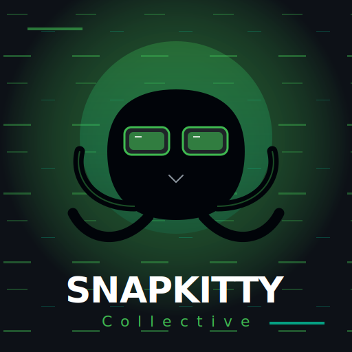

# SnapKitty Collective | Sovereign OS (v2.2.0)

  

**Sovereign OS** is a federated financial execution engine built for the SnapKitty Collective. It replaces fragmented ERP systems with a deterministic, "Bifrost" powered core that unifies capital flow, materials management (MM), and real-time intelligence.

## 🌌 The Bifrost Architecture
The system operates on a decoupled "Bifrost" bridge philosophy:
- **Frontend**: S/4HANA "Horizon" style Vanilla JS Shell (Enterprise High-Density).
- **Backend**: Node.js "Bifrost" API with Prisma/PostgreSQL.
- **Identity**: Microsoft Entra ID (via GoDaddy M365) OIDC Mesh.
- **Ledger**: BigInt-based cents-precision canonical truth (SSOT).

## 🛠 Project Build Status & Telemetry
| Component | Status | Infrastructure |
| :--- | :--- | :--- |
| **Landing Page** | [DNS PENDING] | collectivekitty.com |
| **Sovereign CRM** | [STABLE] | /app.html |
| **Bifrost API** | [ACTIVE] | snapkitty-crm-api (Node.js) |
| **Entra Auth** | [CONFIG] | GoDaddy M365 OIDC |

## 🚀 Deployment Intelligence (Infrastructure Heartbeat)
If `collectivekitty.com` is redirecting to GoDaddy, it is a **DNS propagation** or **A-Record** issue. 

**Required DNS Fixes (GoDaddy Console):**
1. **A Record (@)**: Must point to your deployment IP (e.g., 76.76.21.21 for Vercel).
2. **CNAME (www)**: Points to your deployment domain.
3. **M365 Conflict**: GoDaddy often resets DNS records when M365/Entra is activated. **Manually re-add the A records** if they were deleted by the M365 wizard.

## ⚖️ Core Philosophy: Systems over Software
If a system cannot be reliably repeated, it cannot be trusted. Sovereign OS replaces:
- **Ad-hoc Scripting** → Deterministic T-Codes (FB01, ME21)
- **Subjective Reporting** → Real-time Sovereign Credit Score (SCS)
- **Fragmented Tools** → Unified "Bifrost" Execution Mesh

## 📂 System Hierarchy
- `/app.html` — The SAP-style "Enterprise Cockpit" application.
- `/index.html` — The "Sovereign Wealth" marketing gateway.
- `/snapkitty-crm-api/` — The Node.js "Bifrost" core (Prisma/Express).
- `/styles.css` — High-density Fiori Horizon enterprise theme.

---
**"Software is the most important tool we have. We're building it to be beautiful, deterministic, and sovereign."** — *SnapKitty Collective*
